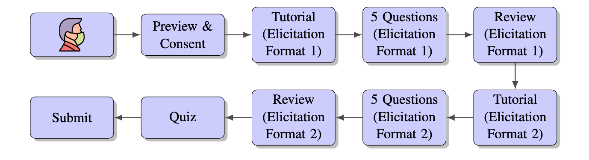

# Surprisingly-Popular-Voting

This github repository provides a brief summary of the paper [Surprisingly Popular Voting Recovers Rankings, Surprisingly!](https://www.cs.toronto.edu/~nisarg/papers/spvoting.pdf) and contains the datasets used in the paper.

## Experimental Workflow

We performed our experiment on Amazon Mechanical Turk (MTurk) involving 720 turkers. The figure above shows the typical workflow of a Turker. Each Turker responded to 10 questions split evenly among two randomly assigned elicitation formats. We had six different elicitation formats.

## Findings

## Description of the Dataset

## How to Cite Our Work

If you use our dataset for further research, please cite our paper as:
- **Surprisingly Popular Voting Recovers Rankings, Surprisingly!**, Hadi Hosseini, Debmalya Mandal, Nisarg Shah, and Kevin Shi, *In Proceedings of the 30th International Joint Conference on Artificial Intelligence* (IJCAI-2021).
